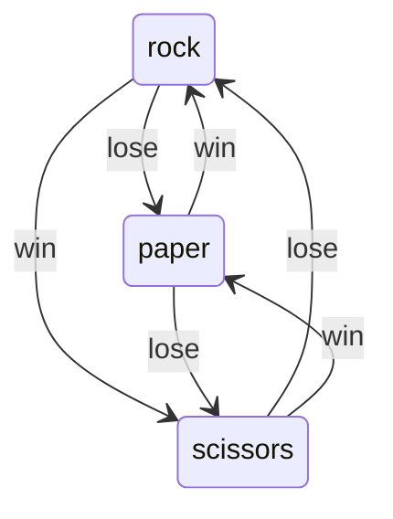
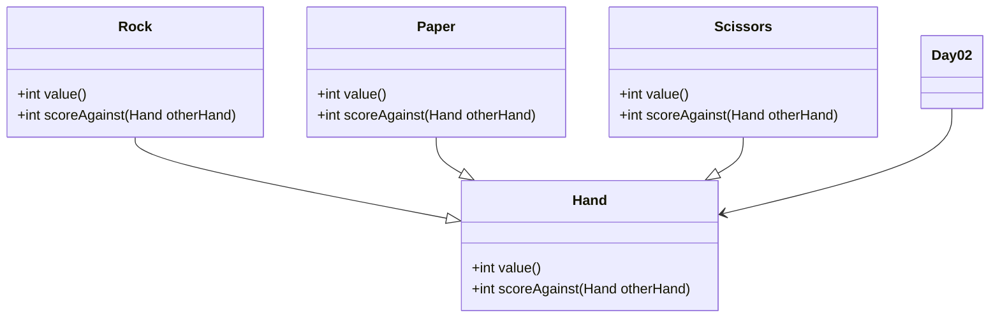

```mermaid
stateDiagram-v2
  rock --> paper: lose
  rock --> scissors: win
  paper --> scissors: lose
  paper --> rock: win
  scissors --> rock: lose
  scissors --> paper: win
```

```mermaid
classDiagram
    Hand: +int value()
    Hand: +int scoreAgainst(Hand otherHand)
    Rock --|> Hand
    Rock: +int value()
    Rock: +int scoreAgainst(Hand otherHand)
    Paper --|> Hand
    Paper: +int value()
    Paper: +int scoreAgainst(Hand otherHand)
    Scissors --|> Hand
    Scissors: +int value()
    Scissors: +int scoreAgainst(Hand otherHand)
    Day02 --> Hand
```